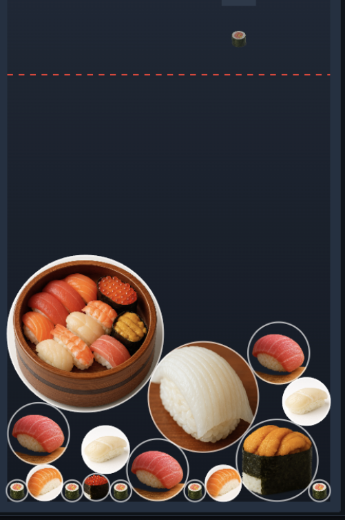

# 🍣 寿司スイカゲーム風 (Sushi Merge Game)

寿司を落として合体させていく、スイカゲーム風のブラウザゲームです。  
同じ寿司同士がぶつかると進化して、最終的には巨大寿司や寿司桶が登場します！

## 🎮 遊び方
- マウスまたはタップで射出口を左右に動かす  
- クリック/タップで寿司を落とす  
- 同じ寿司同士が合体して上位の寿司に進化  
- （今回はゲームオーバーなし！無限に遊べます）

## 🖼 使用素材
- 自作した寿司画像（PNG / 背景透過）を使用しています  
- `static/` フォルダにまとめています

## 🌐 公開方法
GitHub Pages を有効にすると、ブラウザで遊べます。  
URL例:  

